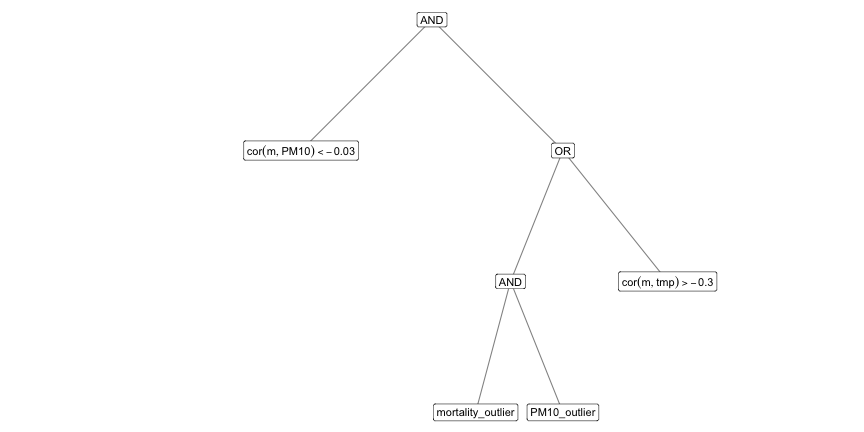

# Reproducible script for *Inside Out: Externalizing Assumptions in Data Analysis as Validation Checks*


``` r
set.seed(1234)
step_count <- tibble(id = 1:300) |>
  rowwise() |>
  mutate(
    small_n = rpois(1, 8),
    large_n = rpois(1, 8),
    norm_sd = rlogis(1, 800, scale = 100),
    norm_n = 30 - small_n - large_n,
    step = list(round(c(rnorm(small_n, 6000, 200),
                        rnorm(large_n, 12000, 200),
                        rnorm(norm_n, 9000, 300)
    ), 0)),
    mean = mean(step, na.rm = TRUE),
    unexpect = ifelse(between(mean, 8500, 9500), 0, 1),
    `q(step, 0.6) > 10000` = ifelse(quantile(step, 0.6, na.rm = TRUE) > 10000, 1, 0),
    `q(step, 0.4) < 8000` = ifelse(quantile(step, 0.4, na.rm = TRUE) < 8000, 1, 0),
    `sd(step) > 2500` = ifelse(sd(step) > 2500, 1, 0),
  ) |>
  ungroup()

step_count |>
  ggplot(aes(x = mean, y = 1, color = as.factor(unexpect))) +
  ggbeeswarm::geom_quasirandom() +
  scale_y_continuous(breaks = seq(0, 13, 1)) +
  scale_color_brewer(palette = "Dark2") +
  xlab("Average number of steps") +
  ylab("") +
  theme_bw() +
  theme(legend.position = "none", panel.grid.minor = element_blank(), axis.text.y = element_blank())
```

```
## Orientation inferred to be along y-axis; override with `position_quasirandom(orientation =
## 'x')`
```

![Beeswarm plot of average step counts across 300 simulated 30-day periods. Each point represents the average step count from one simulation. Similar to a boxplot or violin plot, the beeswarm plot also displays the distribution of each individual data point. The orange points indicate instances where the average step count fails outside the [8,500, 9,500] interval, representing an unexpected outcome in this scenario.](figure/fig-step-count-1.png)

``` r
fit <- step_count |> fit_logic_reg(unexpect, `q(step, 0.6) > 10000`:`sd(step) > 2500`, seed = 1, nleaves = 3)
plot_logicreg(fit)
```


``` r
fit_regtree <- rpart(unexpect ~ ., data = step_count |> dplyr::select(unexpect:`sd(step) > 2500`), method = "class",
                     control = rpart.control(cp = 0.01))
pred_vec <- predict(fit_regtree) |> as_tibble() |> mutate(.fitted = ifelse(`0` > `1`, 0, 1)) |> dplyr::select(.fitted)
regtree_df <- step_count |> dplyr::select(unexpect) |> bind_cols(pred_vec) |>
  calc_miscla_rate(unexpect, .fitted)

sum_entropy <- lapply(as.list(step_count[,c(9:11)]),  function(x){infotheo::entropy(x, method = "emp")}) |> unlist() |> sum()
multi_info <- infotheo::multiinformation(step_count[,c(9:11)])
joint_entropy <- sum_entropy - multi_info
ratio <- joint_entropy / sum_entropy

regtree_df <- regtree_df |>
  mutate(independence =  (ratio - 1/3) / (1 - 1/3)) |>
  calc_metrics(metrics = c("harmonic", "arithmetic"))

sum_entropy <- lapply(as.list(step_count[,c(9,11)]),  function(x){infotheo::entropy(x, method = "emp")}) |> unlist() |> sum()
multi_info <- infotheo::multiinformation(step_count[,c(9,11)])
joint_entropy <- sum_entropy - multi_info
ratio <-  joint_entropy / sum_entropy

another <- tibble(.fitted = as.vector(step_count[,9] & !step_count[,11]) |> as.numeric(),
                  unexpect = step_count$unexpect) |>
  calc_miscla_rate(unexpect, .fitted) |>
  mutate(independence = (ratio - 1/2) / (1 - 1/2)) |>
  calc_metrics(metrics = c("harmonic", "arithmetic")) |>
  mutate(id = 6)
```

``` r
list(tibble(.fitted = step_count$`q(step, 0.6) > 10000`, unexpect = step_count$unexpect),
     tibble(.fitted = step_count$`q(step, 0.4) < 8000`, unexpect = step_count$unexpect),
     tibble(.fitted = step_count$`sd(step) > 2500`, unexpect = step_count$unexpect)
) |>
  map_dfr(~.x |> calc_miscla_rate(unexpect, .fitted) |>
            mutate(independence = 1) |>
            calc_metrics(metrics = c("harmonic", "arithmetic"))) |>
  mutate(checks = c("Check 1: q(step, 0.6) > 10000", "Check 2: q(step, 0.4) < 8000", "Check 3: sd(step) > 2500")) |>
  bind_rows(augment(fit) |>
              calc_miscla_rate(.fitted, unexpect) |>
              calc_independence() |>
              calc_metrics(metrics = c("harmonic", "arithmetic")) |>
              mutate(checks = "Logic regression: (check 1 OR check 2) AND (not check 3)")) |>
  bind_rows(another  |>
              mutate(checks = "Comparison: (check 1) AND (not check 3)")) |>
  bind_rows(regtree_df |>
              mutate(checks = "Regression tree")) |>
  dplyr::select(checks, precision:arithmetic) |>
  dplyr::rename(`indep.` = independence) |>
  kable(digits = 3, escape = FALSE, format = "html", booktab = TRUE,
        col.names = c("Checks", "Precision", "Recall", "Independence", "Harmonic", "Arithmetic")) |>
  kableExtra::kable_styling(latex_options="scale_down") |>
  column_spec(1, width = '19em')
```

<table class="table" style="color: black; margin-left: auto; margin-right: auto;">
 <thead>
  <tr>
   <th style="text-align:left;"> Checks </th>
   <th style="text-align:right;"> Precision </th>
   <th style="text-align:right;"> Recall </th>
   <th style="text-align:right;"> Independence </th>
   <th style="text-align:right;"> Harmonic </th>
   <th style="text-align:right;"> Arithmetic </th>
  </tr>
 </thead>
<tbody>
  <tr>
   <td style="text-align:left;width: 19em; "> Check 1: q(step, 0.6) &gt; 10000 </td>
   <td style="text-align:right;"> 0.319 </td>
   <td style="text-align:right;"> 0.575 </td>
   <td style="text-align:right;"> 1.000 </td>
   <td style="text-align:right;"> 0.511 </td>
   <td style="text-align:right;"> 0.631 </td>
  </tr>
  <tr>
   <td style="text-align:left;width: 19em; "> Check 2: q(step, 0.4) 
   </td>
<td style="text-align:right;"> 0.264 </td>
   <td style="text-align:right;"> 0.613 </td>
   <td style="text-align:right;"> 1.000 </td>
   <td style="text-align:right;"> 0.467 </td>
   <td style="text-align:right;"> 0.626 </td>
  </tr>
  <tr>
   <td style="text-align:left;width: 19em; "> Check 3: sd(step) &gt; 2500 </td>
   <td style="text-align:right;"> 0.153 </td>
   <td style="text-align:right;"> 0.289 </td>
   <td style="text-align:right;"> 1.000 </td>
   <td style="text-align:right;"> 0.273 </td>
   <td style="text-align:right;"> 0.481 </td>
  </tr>
  <tr>
   <td style="text-align:left;width: 19em; "> Logic regression: (check 1 OR check 2) AND (not check 3) </td>
   <td style="text-align:right;"> 0.861 </td>
   <td style="text-align:right;"> 0.431 </td>
   <td style="text-align:right;"> 0.818 </td>
   <td style="text-align:right;"> 0.637 </td>
   <td style="text-align:right;"> 0.703 </td>
  </tr>
  <tr>
   <td style="text-align:left;width: 19em; "> Comparison: (check 1) AND (not check 3) </td>
   <td style="text-align:right;"> 0.278 </td>
   <td style="text-align:right;"> 0.870 </td>
   <td style="text-align:right;"> 0.881 </td>
   <td style="text-align:right;"> 0.510 </td>
   <td style="text-align:right;"> 0.676 </td>
  </tr>
  <tr>
   <td style="text-align:left;width: 19em; "> Regression tree </td>
   <td style="text-align:right;"> 0.542 </td>
   <td style="text-align:right;"> 0.780 </td>
   <td style="text-align:right;"> 0.818 </td>
   <td style="text-align:right;"> 0.689 </td>
   <td style="text-align:right;"> 0.713 </td>
  </tr>
</tbody>
</table>

``` r
aa2 <- fitdistrplus::fitdist(pm10$mortality, "nbinom")
p1 <- tibble(fitted = rnbinom(558, size = aa2$estimate[1], mu = aa2$estimate[2]),
       observed = pm10$mortality) %>%
  ggplot(aes(sample = fitted)) +
  stat_qq_band(fill = "grey80") +
  stat_qq_line(color = "grey30") +
  stat_qq_point(size = 0.3) +
  theme_bw() +
  theme(aspect.ratio = 1) +
  ggtitle("Mortality")


aa6 <- fitdistrplus::fitdist(pm10$pm10[pm10$pm10 < 90]/100, "beta")
p2 <- tibble(fitted = rbeta(557, shape1 = aa6$estimate[1], shape2 = aa6$estimate[2]) * 100,
       observed = pm10$pm10[pm10$pm10 < 90]) %>%
  ggplot(aes(sample = fitted)) +
  stat_qq_band(fill = "grey80") +
  stat_qq_line(color = "grey30") +
  stat_qq_point(size = 0.3) +
  theme_bw() +
  theme(aspect.ratio = 1) +
  ggtitle("PM10")


aa4 <- fitdistrplus::fitdist(pm10$temp, "weibull")
p3 <- tibble(fitted= rweibull(558, aa4$estimate[1], aa4$estimate[2]),
       observed= pm10$temp) %>%
  ggplot(aes(sample = fitted)) +
  stat_qq_band(fill = "grey80") +
  stat_qq_line(color = "grey30") +
  stat_qq_point(size = 0.3) +
  theme_bw() +
  theme(aspect.ratio = 1) +
  ggtitle("Temperature")

p1 | p2 | p3
```


``` r
# cor(pm10$pm10, pm10$mortality)
# cor(pm10$temp, pm10$mortality)
# cor(pm10$temp, pm10$pm10)
corr_grid <- expand.grid(#seq(0.01, 0.2, by = 0.02),
                         seq(-0.1, 0.1, by = 0.02),
                         seq(0.1, 0.5, by = 0.05),
                         seq(0.25, 0.45, by = 0.05))

gen_corr_mtx <- function(r1, r2, r3) {
  # correlation between mortality and pm10 are negative - r1
  # correlation between mortality and temp are negative - r2
  cor_matrix <- matrix(c(1, r1, -r2,
                         r1, 1, r3,
                         -r2, r3, 1), nrow = 3, byrow = TRUE)
  if (all(eigen(cor_matrix)$values > 0)) return(cor_matrix)
}

corr_mtx <- lapply(1:nrow(corr_grid), function(i) {
  gen_corr_mtx(corr_grid[i, 1], corr_grid[i, 2], corr_grid[i, 3]) })
corr_mtx <- corr_mtx[map_lgl(corr_mtx, ~!is.null(.x))]
sample_size <- c(500, 3000)
outlier <- c(TRUE, FALSE)

generate_data <- function(n, mtx, seed = 123, outlier = FALSE) {
  mu <- c(0, 0, 0)
  set.seed(seed)
  data <- mvrnorm(n, mu, mtx, empirical = TRUE)
  U <- pnorm(data, mean = 0, sd = 1)

  if (!outlier) {
    tibble(mortality = qnbinom(U[,1], size = 74, mu = 183),
           pm10 = qbeta(U[,2], shape1 = 4.21, shape2 = 11.67) * 100,
           temp = qweibull(U[,3], shape = 3.8, scale = 61))
  } else{
    pm10_vec <- qbeta(U[,2], shape1 = 4.21, shape2 = 11.67) * 100
    tibble(
      mortality = c(qnbinom(U[,1], size = 74, mu = 183)[-1],
                    rnorm(n = 1, mean = 300, sd = 10)),
      pm10 = c(pm10_vec[-1], rnorm(n = 1, mean = 100, sd = 10)),
      temp = qweibull(U[,3], shape = 3.8, scale = 61)
    )
  }

}

res <- tibble(corr_mtx = corr_mtx) |>
  mutate(id = row_number()) |>
  crossing(sample_size, outlier) |>
  rowwise() |>
  mutate(data = list(generate_data(n = sample_size, mtx = corr_mtx, outlier = outlier)),
         fit = list(summary(glm(mortality ~ pm10 + temp, family = "poisson", data))$coefficients))
```

```
## Warning: There were 990 warnings in `mutate()`.
## The first warning was:
## ℹ In argument: `fit = list(...)`.
## ℹ In row 2.
## Caused by warning in `dpois()`:
## ! non-integer x = 291.790133
## ℹ Run `dplyr::last_dplyr_warnings()` to see the 989 remaining warnings.
```

``` r
pm10_df <- res |>
  mutate(
    p_value = fit[2,4],
    coef = fit[2,1],
    mor_pm10_correlation = corr_mtx[1, 2],
    mor_temp_correlation = corr_mtx[1, 3],
    temp_pm10_yz_correlation = corr_mtx[2, 3],
    unexpect = ifelse(between(coef, 0, 0.005), 0, 1),
    `cor(m, PM10) < -0.05` = ifelse(mor_pm10_correlation < -0.05, 1, 0),
    `cor(m, PM10) < -0.03` = ifelse(mor_pm10_correlation < -0.03, 1, 0),
    `cor(m, PM10) > 0.03` = ifelse(mor_pm10_correlation > 0.03, 1, 0),
    `cor(m, PM10) > 0.05` = ifelse(mor_pm10_correlation > 0.05, 1, 0),
    `cor(m, tmp) > -0.3` = ifelse(mor_temp_correlation > -0.3, 1, 0),
    `cor(m, tmp) > -0.35` = ifelse(mor_temp_correlation > -0.35, 1, 0),
    `cor(m, tmp) > -0.4` = ifelse(mor_temp_correlation > -0.4, 1, 0),
    `cor(m, tmp) > -0.45` = ifelse(mor_temp_correlation > -0.45, 1, 0)
  ) |>
  ungroup()

pm10_df <- pm10_df |>
  rowwise() |>
  mutate(PM10_outlier = ifelse(any(scale(data$pm10) > 4), 1, 0),
         mortality_outlier = ifelse(any(scale(data$mortality) > 4), 1, 0)
  ) |>
  ungroup()

unexpect_df <- tibble(
  unexpect = c(0, 1),
  n = pm10_df$unexpect |> table() |> as.numeric() |> rev(),
  wgt = n/sum(n))
wgt_vec <- pm10_df |> dplyr::select(unexpect) |> left_join(unexpect_df) |> pull(wgt)
```

```
## Joining with `by = join_by(unexpect)`
```

``` r
fit <- pm10_df |> fit_logic_reg(unexpect, `cor(m, PM10) < -0.05`:mortality_outlier,
                                seed = 7, nleaves = 4, wgt = wgt_vec)
plot_logicreg(fit)
```



``` r
df <- list(
  tibble(.fitted = pm10_df$`cor(m, PM10) < -0.03`,
         unexpect = pm10_df$unexpect),
  tibble(.fitted = pm10_df$`cor(m, tmp) > -0.3`,
         unexpect = pm10_df$unexpect),
  tibble(.fitted = pm10_df$mortality_outlier,
         unexpect = pm10_df$unexpect),
  tibble(.fitted = pm10_df$PM10_outlier,
         unexpect = pm10_df$unexpect)) |>
  map_dfr(~.x |> calc_miscla_rate(.fitted, unexpect) |>
            mutate(independence = 1) |>
            calc_metrics(metrics = c("harmonic", "arithmetic")), .id = "id") |>
  mutate(id = as.numeric(id))

reg <- fit |> augment() |>
  calc_miscla_rate(unexpect, .fitted) |>
  calc_independence() |>
  calc_metrics(metrics = c("harmonic", "arithmetic")) |>
  mutate(id = 5)

df <- df |> bind_rows(reg)

tbl <- tibble(check = c("Check 1: cor(m, PM10) < -- 0.03", "Check 2: cor(m, tmp) > -- 0.35",
                        "Check 3: mortality outlier", "Check 4: PM10 outlier",
                        "Logic regression: (check 1) AND ((check 2) OR (check 3 AND check 4))")) |>
  bind_cols(df |> dplyr::select(-id)) |> rename(`indep.` = independence)

tbl |>
  kable(digits = 3, escape = FALSE, format = "html", booktab = TRUE,
        col.names = c("Checks", "Precision", "Recall", "Independence", "Harmonic", "Arithmetic")) |>
  kableExtra::kable_styling(latex_options="scale_down") |>
  column_spec(1, width = '18em')
```

<table class="table" style="color: black; margin-left: auto; margin-right: auto;">
 <thead>
  <tr>
   <th style="text-align:left;"> Checks </th>
   <th style="text-align:right;"> Precision </th>
   <th style="text-align:right;"> Recall </th>
   <th style="text-align:right;"> Independence </th>
   <th style="text-align:right;"> Harmonic </th>
   <th style="text-align:right;"> Arithmetic </th>
  </tr>
 </thead>
<tbody>
  <tr>
   <td style="text-align:left;width: 18em; "> Check 1: cor(m, PM10) 
   </td>
<td style="text-align:right;"> 0.551 </td>
   <td style="text-align:right;"> 0.894 </td>
   <td style="text-align:right;"> 1.000 </td>
   <td style="text-align:right;"> 0.763 </td>
   <td style="text-align:right;"> 0.815 </td>
  </tr>
  <tr>
   <td style="text-align:left;width: 18em; "> Check 2: cor(m, tmp) &gt; -- 0.35 </td>
   <td style="text-align:right;"> 0.281 </td>
   <td style="text-align:right;"> 0.556 </td>
   <td style="text-align:right;"> 1.000 </td>
   <td style="text-align:right;"> 0.472 </td>
   <td style="text-align:right;"> 0.612 </td>
  </tr>
  <tr>
   <td style="text-align:left;width: 18em; "> Check 3: mortality outlier </td>
   <td style="text-align:right;"> 0.302 </td>
   <td style="text-align:right;"> 0.775 </td>
   <td style="text-align:right;"> 1.000 </td>
   <td style="text-align:right;"> 0.536 </td>
   <td style="text-align:right;"> 0.692 </td>
  </tr>
  <tr>
   <td style="text-align:left;width: 18em; "> Check 4: PM10 outlier </td>
   <td style="text-align:right;"> 0.305 </td>
   <td style="text-align:right;"> 0.766 </td>
   <td style="text-align:right;"> 1.000 </td>
   <td style="text-align:right;"> 0.537 </td>
   <td style="text-align:right;"> 0.690 </td>
  </tr>
  <tr>
   <td style="text-align:left;width: 18em; "> Logic regression: (check 1) AND ((check 2) OR (check 3 AND check 4)) </td>
   <td style="text-align:right;"> 0.876 </td>
   <td style="text-align:right;"> 0.722 </td>
   <td style="text-align:right;"> 0.812 </td>
   <td style="text-align:right;"> 0.798 </td>
   <td style="text-align:right;"> 0.803 </td>
  </tr>
</tbody>
</table>

``` r
pm10 <- read_csv("data/pm10.csv", col_types = cols()) |> filter(!is.na(pm10)) |> filter(!is.na(temp))
files <- list.files(path = "data", pattern = "csv", full.names = TRUE)[-1]
pred_res <- files |> map_dfr(function(raw){
  data <- read_csv(raw, col_types = cols()) |> filter(!is.na(pm10)) |> filter(!is.na(temp))
  res_df <- glm(mortality ~ pm10 + temp, family = "poisson", data = data)$coefficients |>
    as_tibble_row()

  res_df |>
    mutate(
      cor_m_tmp = cor(data$mortality, data$temp),
      cor_m_pm10 = cor(data$mortality, data$pm10),
      cor_tmp_pm10 = cor(data$temp, data$pm10),
      unexpect = !between(pm10, 0, 0.005),
      mort_outlier = any(scale(data$mortality) > 4),
      pm10_outlier = any(scale(data$pm10) > 4),
      lgl_cor_m_tmp = cor(data$mortality, data$temp) > -0.3,
      lgl_cor_m_pm10 = cor(data$mortality, data$pm10) < -0.03,
      .pred = ((mort_outlier &  pm10_outlier) | (lgl_cor_m_tmp)) & (lgl_cor_m_pm10),
      ss = nrow(data)
    )
})
city_name_map <- read_csv(here::here("data/city_name_map.csv"),col_types = cols())


df <- tibble(city = str_remove(files, "data/pm10-") |> str_remove(".csv")) |> bind_cols(pred_res) |>
  left_join(city_name_map) |>
  filter(city != "data/pm10") |>
  dplyr::select(cityname, pm10, unexpect, .pred,
                cor_m_tmp, lgl_cor_m_tmp,
                cor_m_pm10, lgl_cor_m_pm10,
                mort_outlier, pm10_outlier)
```

```
## Joining with `by = join_by(city)`
```

``` r
df |>
  mutate(pm10 = format(round(pm10, 4), nsmall = 4),
         cor_m_tmp = format(round(cor_m_tmp, 2), nsmall = 2),
         cor_m_pm10 = format(round(cor_m_pm10, 2), nsmall = 2)) |>
  mutate(across(c(unexpect, .pred, lgl_cor_m_pm10, lgl_cor_m_tmp, mort_outlier, pm10_outlier),
                ~ifelse(.x, "T", "F"))) |>
  mutate(cor_m_tmp = paste0(cor_m_tmp, " (", lgl_cor_m_tmp, ")"),
         cor_m_pm10 = paste0(cor_m_pm10, " (", lgl_cor_m_pm10, ")")) |>
  dplyr::select(-lgl_cor_m_tmp, -lgl_cor_m_pm10) |>
  kable(format = "html", booktabs = TRUE, escape = F,
        align = "lrccrrcc")
```

<table>
 <thead>
  <tr>
   <th style="text-align:left;"> cityname </th>
   <th style="text-align:right;"> pm10 </th>
   <th style="text-align:center;"> unexpect </th>
   <th style="text-align:center;"> .pred </th>
   <th style="text-align:right;"> cor_m_tmp </th>
   <th style="text-align:right;"> cor_m_pm10 </th>
   <th style="text-align:center;"> mort_outlier </th>
   <th style="text-align:center;"> pm10_outlier </th>
  </tr>
 </thead>
<tbody>
  <tr>
   <td style="text-align:left;"> Atlanta </td>
   <td style="text-align:right;"> -0.0008 </td>
   <td style="text-align:center;"> T </td>
   <td style="text-align:center;"> T </td>
   <td style="text-align:right;"> -0.26 (T) </td>
   <td style="text-align:right;"> -0.16 (T) </td>
   <td style="text-align:center;"> F </td>
   <td style="text-align:center;"> F </td>
  </tr>
  <tr>
   <td style="text-align:left;"> Austin </td>
   <td style="text-align:right;"> -0.0030 </td>
   <td style="text-align:center;"> T </td>
   <td style="text-align:center;"> T </td>
   <td style="text-align:right;"> -0.12 (T) </td>
   <td style="text-align:right;"> -0.11 (T) </td>
   <td style="text-align:center;"> F </td>
   <td style="text-align:center;"> T </td>
  </tr>
  <tr>
   <td style="text-align:left;"> Baltimore </td>
   <td style="text-align:right;"> 0.0018 </td>
   <td style="text-align:center;"> F </td>
   <td style="text-align:center;"> F </td>
   <td style="text-align:right;"> -0.21 (T) </td>
   <td style="text-align:right;"> 0.01 (F) </td>
   <td style="text-align:center;"> T </td>
   <td style="text-align:center;"> T </td>
  </tr>
  <tr>
   <td style="text-align:left;"> Boston </td>
   <td style="text-align:right;"> 0.0019 </td>
   <td style="text-align:center;"> F </td>
   <td style="text-align:center;"> F </td>
   <td style="text-align:right;"> -0.16 (T) </td>
   <td style="text-align:right;"> 0.02 (F) </td>
   <td style="text-align:center;"> F </td>
   <td style="text-align:center;"> T </td>
  </tr>
  <tr>
   <td style="text-align:left;"> Buffalo </td>
   <td style="text-align:right;"> 0.0028 </td>
   <td style="text-align:center;"> F </td>
   <td style="text-align:center;"> F </td>
   <td style="text-align:right;"> -0.23 (T) </td>
   <td style="text-align:right;"> -0.02 (F) </td>
   <td style="text-align:center;"> F </td>
   <td style="text-align:center;"> T </td>
  </tr>
  <tr>
   <td style="text-align:left;"> Chicago </td>
   <td style="text-align:right;"> 0.0011 </td>
   <td style="text-align:center;"> F </td>
   <td style="text-align:center;"> F </td>
   <td style="text-align:right;"> -0.38 (F) </td>
   <td style="text-align:right;"> -0.02 (F) </td>
   <td style="text-align:center;"> T </td>
   <td style="text-align:center;"> T </td>
  </tr>
  <tr>
   <td style="text-align:left;"> Cincinnati </td>
   <td style="text-align:right;"> 0.0011 </td>
   <td style="text-align:center;"> F </td>
   <td style="text-align:center;"> T </td>
   <td style="text-align:right;"> -0.27 (T) </td>
   <td style="text-align:right;"> -0.06 (T) </td>
   <td style="text-align:center;"> T </td>
   <td style="text-align:center;"> T </td>
  </tr>
  <tr>
   <td style="text-align:left;"> Cleveland </td>
   <td style="text-align:right;"> 0.0010 </td>
   <td style="text-align:center;"> F </td>
   <td style="text-align:center;"> F </td>
   <td style="text-align:right;"> -0.30 (F) </td>
   <td style="text-align:right;"> -0.02 (F) </td>
   <td style="text-align:center;"> T </td>
   <td style="text-align:center;"> T </td>
  </tr>
  <tr>
   <td style="text-align:left;"> Columbus </td>
   <td style="text-align:right;"> 0.0004 </td>
   <td style="text-align:center;"> F </td>
   <td style="text-align:center;"> T </td>
   <td style="text-align:right;"> -0.20 (T) </td>
   <td style="text-align:right;"> -0.07 (T) </td>
   <td style="text-align:center;"> F </td>
   <td style="text-align:center;"> T </td>
  </tr>
  <tr>
   <td style="text-align:left;"> Denver </td>
   <td style="text-align:right;"> 0.0010 </td>
   <td style="text-align:center;"> F </td>
   <td style="text-align:center;"> F </td>
   <td style="text-align:right;"> -0.23 (T) </td>
   <td style="text-align:right;"> 0.06 (F) </td>
   <td style="text-align:center;"> F </td>
   <td style="text-align:center;"> T </td>
  </tr>
  <tr>
   <td style="text-align:left;"> Detroit </td>
   <td style="text-align:right;"> 0.0011 </td>
   <td style="text-align:center;"> F </td>
   <td style="text-align:center;"> F </td>
   <td style="text-align:right;"> -0.30 (T) </td>
   <td style="text-align:right;"> 0.04 (F) </td>
   <td style="text-align:center;"> F </td>
   <td style="text-align:center;"> T </td>
  </tr>
  <tr>
   <td style="text-align:left;"> Dallas/Fort Worth </td>
   <td style="text-align:right;"> 0.0016 </td>
   <td style="text-align:center;"> F </td>
   <td style="text-align:center;"> T </td>
   <td style="text-align:right;"> -0.30 (F) </td>
   <td style="text-align:right;"> -0.03 (T) </td>
   <td style="text-align:center;"> T </td>
   <td style="text-align:center;"> T </td>
  </tr>
  <tr>
   <td style="text-align:left;"> Honolulu </td>
   <td style="text-align:right;"> 0.0006 </td>
   <td style="text-align:center;"> F </td>
   <td style="text-align:center;"> F </td>
   <td style="text-align:right;"> -0.17 (T) </td>
   <td style="text-align:right;"> 0.05 (F) </td>
   <td style="text-align:center;"> T </td>
   <td style="text-align:center;"> T </td>
  </tr>
  <tr>
   <td style="text-align:left;"> Houston </td>
   <td style="text-align:right;"> 0.0007 </td>
   <td style="text-align:center;"> F </td>
   <td style="text-align:center;"> F </td>
   <td style="text-align:right;"> -0.22 (T) </td>
   <td style="text-align:right;"> -0.03 (F) </td>
   <td style="text-align:center;"> F </td>
   <td style="text-align:center;"> T </td>
  </tr>
  <tr>
   <td style="text-align:left;"> Indianapolis </td>
   <td style="text-align:right;"> 0.0014 </td>
   <td style="text-align:center;"> F </td>
   <td style="text-align:center;"> F </td>
   <td style="text-align:right;"> -0.13 (T) </td>
   <td style="text-align:right;"> 0.02 (F) </td>
   <td style="text-align:center;"> F </td>
   <td style="text-align:center;"> T </td>
  </tr>
  <tr>
   <td style="text-align:left;"> Kansas City </td>
   <td style="text-align:right;"> 0.0022 </td>
   <td style="text-align:center;"> F </td>
   <td style="text-align:center;"> F </td>
   <td style="text-align:right;"> -0.20 (T) </td>
   <td style="text-align:right;"> 0.02 (F) </td>
   <td style="text-align:center;"> F </td>
   <td style="text-align:center;"> T </td>
  </tr>
  <tr>
   <td style="text-align:left;"> Los Angeles </td>
   <td style="text-align:right;"> 0.0011 </td>
   <td style="text-align:center;"> F </td>
   <td style="text-align:center;"> F </td>
   <td style="text-align:right;"> -0.47 (F) </td>
   <td style="text-align:right;"> -0.01 (F) </td>
   <td style="text-align:center;"> T </td>
   <td style="text-align:center;"> T </td>
  </tr>
  <tr>
   <td style="text-align:left;"> Las Vegas </td>
   <td style="text-align:right;"> 0.0008 </td>
   <td style="text-align:center;"> F </td>
   <td style="text-align:center;"> F </td>
   <td style="text-align:right;"> -0.27 (T) </td>
   <td style="text-align:right;"> 0.05 (F) </td>
   <td style="text-align:center;"> T </td>
   <td style="text-align:center;"> T </td>
  </tr>
  <tr>
   <td style="text-align:left;"> Memphis </td>
   <td style="text-align:right;"> -0.0007 </td>
   <td style="text-align:center;"> T </td>
   <td style="text-align:center;"> T </td>
   <td style="text-align:right;"> -0.16 (T) </td>
   <td style="text-align:right;"> -0.10 (T) </td>
   <td style="text-align:center;"> F </td>
   <td style="text-align:center;"> T </td>
  </tr>
  <tr>
   <td style="text-align:left;"> Miami </td>
   <td style="text-align:right;"> -0.0004 </td>
   <td style="text-align:center;"> T </td>
   <td style="text-align:center;"> F </td>
   <td style="text-align:right;"> -0.16 (T) </td>
   <td style="text-align:right;"> -0.02 (F) </td>
   <td style="text-align:center;"> F </td>
   <td style="text-align:center;"> T </td>
  </tr>
  <tr>
   <td style="text-align:left;"> Milwaukee </td>
   <td style="text-align:right;"> 0.0026 </td>
   <td style="text-align:center;"> F </td>
   <td style="text-align:center;"> F </td>
   <td style="text-align:right;"> -0.22 (T) </td>
   <td style="text-align:right;"> 0.09 (F) </td>
   <td style="text-align:center;"> F </td>
   <td style="text-align:center;"> T </td>
  </tr>
  <tr>
   <td style="text-align:left;"> Minneapolis/St. Paul </td>
   <td style="text-align:right;"> 0.0009 </td>
   <td style="text-align:center;"> F </td>
   <td style="text-align:center;"> F </td>
   <td style="text-align:right;"> -0.30 (F) </td>
   <td style="text-align:right;"> -0.01 (F) </td>
   <td style="text-align:center;"> T </td>
   <td style="text-align:center;"> T </td>
  </tr>
  <tr>
   <td style="text-align:left;"> New York </td>
   <td style="text-align:right;"> 0.0022 </td>
   <td style="text-align:center;"> F </td>
   <td style="text-align:center;"> F </td>
   <td style="text-align:right;"> -0.46 (F) </td>
   <td style="text-align:right;"> -0.01 (F) </td>
   <td style="text-align:center;"> T </td>
   <td style="text-align:center;"> T </td>
  </tr>
  <tr>
   <td style="text-align:left;"> Oakland </td>
   <td style="text-align:right;"> 0.0008 </td>
   <td style="text-align:center;"> F </td>
   <td style="text-align:center;"> F </td>
   <td style="text-align:right;"> -0.28 (T) </td>
   <td style="text-align:right;"> 0.04 (F) </td>
   <td style="text-align:center;"> F </td>
   <td style="text-align:center;"> T </td>
  </tr>
  <tr>
   <td style="text-align:left;"> Orlando </td>
   <td style="text-align:right;"> -0.0008 </td>
   <td style="text-align:center;"> T </td>
   <td style="text-align:center;"> T </td>
   <td style="text-align:right;"> -0.21 (T) </td>
   <td style="text-align:right;"> -0.05 (T) </td>
   <td style="text-align:center;"> F </td>
   <td style="text-align:center;"> T </td>
  </tr>
  <tr>
   <td style="text-align:left;"> Philadelphia </td>
   <td style="text-align:right;"> 0.0021 </td>
   <td style="text-align:center;"> F </td>
   <td style="text-align:center;"> F </td>
   <td style="text-align:right;"> -0.27 (T) </td>
   <td style="text-align:right;"> 0.11 (F) </td>
   <td style="text-align:center;"> T </td>
   <td style="text-align:center;"> T </td>
  </tr>
  <tr>
   <td style="text-align:left;"> Phoenix </td>
   <td style="text-align:right;"> 0.0009 </td>
   <td style="text-align:center;"> F </td>
   <td style="text-align:center;"> F </td>
   <td style="text-align:right;"> -0.44 (F) </td>
   <td style="text-align:right;"> 0.07 (F) </td>
   <td style="text-align:center;"> T </td>
   <td style="text-align:center;"> T </td>
  </tr>
  <tr>
   <td style="text-align:left;"> Pittsburgh </td>
   <td style="text-align:right;"> 0.0009 </td>
   <td style="text-align:center;"> F </td>
   <td style="text-align:center;"> T </td>
   <td style="text-align:right;"> -0.36 (F) </td>
   <td style="text-align:right;"> -0.08 (T) </td>
   <td style="text-align:center;"> T </td>
   <td style="text-align:center;"> T </td>
  </tr>
  <tr>
   <td style="text-align:left;"> Riverside </td>
   <td style="text-align:right;"> 0.0001 </td>
   <td style="text-align:center;"> F </td>
   <td style="text-align:center;"> T </td>
   <td style="text-align:right;"> -0.27 (T) </td>
   <td style="text-align:right;"> -0.11 (T) </td>
   <td style="text-align:center;"> T </td>
   <td style="text-align:center;"> T </td>
  </tr>
  <tr>
   <td style="text-align:left;"> Sacramento </td>
   <td style="text-align:right;"> 0.0005 </td>
   <td style="text-align:center;"> F </td>
   <td style="text-align:center;"> F </td>
   <td style="text-align:right;"> -0.30 (T) </td>
   <td style="text-align:right;"> 0.05 (F) </td>
   <td style="text-align:center;"> T </td>
   <td style="text-align:center;"> T </td>
  </tr>
  <tr>
   <td style="text-align:left;"> Salt Lake City </td>
   <td style="text-align:right;"> -0.0004 </td>
   <td style="text-align:center;"> T </td>
   <td style="text-align:center;"> T </td>
   <td style="text-align:right;"> -0.19 (T) </td>
   <td style="text-align:right;"> -0.03 (T) </td>
   <td style="text-align:center;"> F </td>
   <td style="text-align:center;"> T </td>
  </tr>
  <tr>
   <td style="text-align:left;"> San Antonio </td>
   <td style="text-align:right;"> -0.0021 </td>
   <td style="text-align:center;"> T </td>
   <td style="text-align:center;"> T </td>
   <td style="text-align:right;"> -0.22 (T) </td>
   <td style="text-align:right;"> -0.16 (T) </td>
   <td style="text-align:center;"> F </td>
   <td style="text-align:center;"> T </td>
  </tr>
  <tr>
   <td style="text-align:left;"> San Bernardino </td>
   <td style="text-align:right;"> 0.0006 </td>
   <td style="text-align:center;"> F </td>
   <td style="text-align:center;"> T </td>
   <td style="text-align:right;"> -0.28 (T) </td>
   <td style="text-align:right;"> -0.09 (T) </td>
   <td style="text-align:center;"> T </td>
   <td style="text-align:center;"> T </td>
  </tr>
  <tr>
   <td style="text-align:left;"> San Diego </td>
   <td style="text-align:right;"> 0.0011 </td>
   <td style="text-align:center;"> F </td>
   <td style="text-align:center;"> F </td>
   <td style="text-align:right;"> -0.33 (F) </td>
   <td style="text-align:right;"> 0.03 (F) </td>
   <td style="text-align:center;"> T </td>
   <td style="text-align:center;"> T </td>
  </tr>
  <tr>
   <td style="text-align:left;"> San Jose </td>
   <td style="text-align:right;"> 0.0006 </td>
   <td style="text-align:center;"> F </td>
   <td style="text-align:center;"> F </td>
   <td style="text-align:right;"> -0.23 (T) </td>
   <td style="text-align:right;"> 0.08 (F) </td>
   <td style="text-align:center;"> F </td>
   <td style="text-align:center;"> T </td>
  </tr>
  <tr>
   <td style="text-align:left;"> Seattle </td>
   <td style="text-align:right;"> 0.0003 </td>
   <td style="text-align:center;"> F </td>
   <td style="text-align:center;"> F </td>
   <td style="text-align:right;"> -0.24 (T) </td>
   <td style="text-align:right;"> 0.06 (F) </td>
   <td style="text-align:center;"> F </td>
   <td style="text-align:center;"> T </td>
  </tr>
  <tr>
   <td style="text-align:left;"> Santa Ana/Anaheim </td>
   <td style="text-align:right;"> 0.0005 </td>
   <td style="text-align:center;"> F </td>
   <td style="text-align:center;"> T </td>
   <td style="text-align:right;"> -0.26 (T) </td>
   <td style="text-align:right;"> -0.04 (T) </td>
   <td style="text-align:center;"> T </td>
   <td style="text-align:center;"> T </td>
  </tr>
  <tr>
   <td style="text-align:left;"> St. Petersburg </td>
   <td style="text-align:right;"> 0.0012 </td>
   <td style="text-align:center;"> F </td>
   <td style="text-align:center;"> F </td>
   <td style="text-align:right;"> -0.31 (F) </td>
   <td style="text-align:right;"> 0.01 (F) </td>
   <td style="text-align:center;"> F </td>
   <td style="text-align:center;"> T </td>
  </tr>
  <tr>
   <td style="text-align:left;"> Tampa </td>
   <td style="text-align:right;"> -0.0003 </td>
   <td style="text-align:center;"> T </td>
   <td style="text-align:center;"> T </td>
   <td style="text-align:right;"> -0.20 (T) </td>
   <td style="text-align:right;"> -0.04 (T) </td>
   <td style="text-align:center;"> F </td>
   <td style="text-align:center;"> T </td>
  </tr>
  <tr>
   <td style="text-align:left;"> Tucson </td>
   <td style="text-align:right;"> 0.0028 </td>
   <td style="text-align:center;"> F </td>
   <td style="text-align:center;"> F </td>
   <td style="text-align:right;"> -0.31 (F) </td>
   <td style="text-align:right;"> 0.18 (F) </td>
   <td style="text-align:center;"> T </td>
   <td style="text-align:center;"> T </td>
  </tr>
</tbody>
</table>

``` r
df |>
  dplyr::select(unexpect, .pred) |>
  table() |>
  as_tibble() |>
  rename(Observed = unexpect) |>
  pivot_wider(names_from = .pred, values_from = n) |>
  kable(format = "html",
        booktabs = TRUE) |>
   add_header_above(c("", "Predicted"=2),
                    escape = FALSE)
```

<table>
 <thead>
<tr>
<th style="empty-cells: hide;border-bottom:hidden;" colspan="1"></th>
<th style="border-bottom:hidden;padding-bottom:0; padding-left:3px;padding-right:3px;text-align: center; " colspan="2"><div style="border-bottom: 1px solid #ddd; padding-bottom: 5px; ">Predicted</div></th>
</tr>
  <tr>
   <th style="text-align:left;"> Observed </th>
   <th style="text-align:right;"> FALSE </th>
   <th style="text-align:right;"> TRUE </th>
  </tr>
 </thead>
<tbody>
  <tr>
   <td style="text-align:left;"> FALSE </td>
   <td style="text-align:right;"> 25 </td>
   <td style="text-align:right;"> 7 </td>
  </tr>
  <tr>
   <td style="text-align:left;"> TRUE </td>
   <td style="text-align:right;"> 1 </td>
   <td style="text-align:right;"> 7 </td>
  </tr>
</tbody>
</table>

